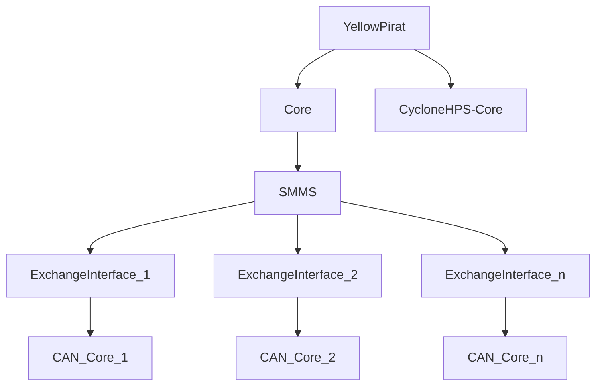

# Introduction
This is repository contains a CAN interface writen in VHDL.
The interface is capable of reading data from a CAN-Network.
The read data is than provided with an AXI4-Lite Interface. 
In the Top-Level Entity you can specifiy how many CAN-Cores are 
initialised during synthesis. All CAN-Cores are than connected with an 
AXI Interconnect. The Top-Level entity one AXI interface, for a 
master implementation. The different CAN-Cores are aranged in 
different memory areas.

# Structure
This picture describes the structure of the entities.


The entity YellowPirat is specific for our HW implementation. 
For different HW-platforms, this part must be adapted.
The Core entity is the TopLevel-Entity of this project.

# Install Quartus
Refer to (https://www.hs-augsburg.de/homes/beckmanf/dokuwiki/doku.php?id=ubuntu_virtual_cae_system)

# Install CAN_CORE
```
# Clone the repository
git clone --recurse-submodules https://github.com/YellowPirat/CAN_CORE.git

# If you forgot the recurse-flag ;=)
git submodule update

# Navigate to the project
cd CAN_CORE

# source activate script
source activate.sh

# Create Quartus project and hps core (Can be skipped if already done)
cd project_files
make qip
cd ../synthese/core
make qpf

# Compile exchange_interface
make compile
make rbf

# Enable stuff
sudo update-binfmts --enable qemu-arm
```

# Create bootable device (Instert SD-Card)

Refer to [de1soc-imager](./linux/de1soc-imager/README.md)

# Usage
## UART
Connection via UART
```
gtkterm --port=/dev/ttyUSB0
```

## Reading a Frame
Read data from the AXI register 
```
    sudo memtool md 0xff200000+44
```

## Setting Baudrate Config
Config Sample Unit 1M
```
sudo memtool mw 0xff20002c 0x00000001
sudo memtool mw 0xff200030 0x00000002
sudo memtool mw 0xff200034 0x00000004
sudo memtool mw 0xff200038 0x00000003
sudo memtool mw 0xff20003c 0x00000004
sudo memtool mw 0xff200040 0x00000001

```

Config Sample Unit 500k
```
sudo memtool mw 0xff20002c 0x00000001
sudo memtool mw 0xff200030 0x00000005
sudo memtool mw 0xff200034 0x00000007
sudo memtool mw 0xff200038 0x00000007
sudo memtool mw 0xff20003c 0x00000004
sudo memtool mw 0xff200040 0x00000001
```
